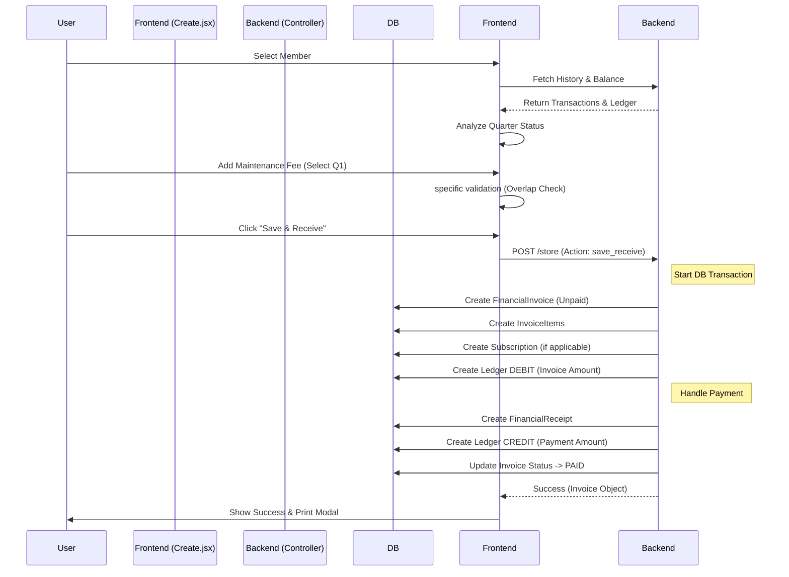

# Invoice Creation Workflow

This document details the end-to-end flow of creating a financial transaction (Invoice) in the AFOHS Club system.

## 1. High Level Overview

The Invoice Creation module (`Create.jsx`) allows admins to generate invoices for **Regular Members**, **Corporate Members**, and **Guests**. It supports multi-item invoices, automatic date calculations for maintenance fees, and immediate payment processing.

### Key Components

- **Frontend**: `resources/js/components/App/Transactions/Create.jsx`
- **Backend Controller**: `app/Http/Controllers/MemberTransactionController.php`
- **Main Models**: `FinancialInvoice`, `FinancialInvoiceItem`, `Transaction` (Ledger), `FinancialReceipt`, `MaintenanceFee` (Database Logic Refactored).

---

## 2. Frontend Flow (`Create.jsx`)

### A. Member Selection

1.  **Booking Type Selection**: User selects "Member", "Corporate", or "Guest".
2.  **Search**: `AsyncSearchTextField` queries the backend (`finance.transaction.search`).
3.  **Selection**: fetching member details, current Ledger Balance, and Transaction History.
4.  **Quarter Analysis**: The system immediately analyzes previous `maintenance_fee` transactions to determine the "Quarter Payment Status" (e.g., Q1 Paid, Q2 Unpaid).

### B. Adding Items (InvoiceItemsGrid)

Users add items to the invoice. Key logic per fee type:

- **Membership Fee**:
    - **Amount**: Auto-filled from `member.membership_fee`.
    - **Validity**: Defaults to 4 years.
- **Maintenance Fee**:
    - **Logic**: Uses `suggestMaintenancePeriod(frequency)` to calculate dates.
    - **Dates**: `valid_from` is auto-set to the 1st of the next unpaid month. `valid_to` is the last date of the covered period.
    - **Validation**: Frontend prevents overlapping dates with existing _active/paid_ maintenance periods.
- **Subscription Fee**:
    - **Selection**: User selects Category (e.g., Gym) and Type (e.g., Monthly).
    - **Amount**: Fetched from `TransactionType` or `SubscriptionCategory`.

### C. Validation Checks

Before submission, the frontend validates:

- Member is selected.
- At least one item exists.
- **Date Overlap**: Checks if selected Maintenance Fee dates overlap with existing paid history.
- **Duplicate Items**: Prevents adding the same Fee Type multiple times if restricted (e.g., one maintenance fee per invoice).

---

## 3. Backend Processing (`MemberTransactionController.php`)

The `store` method handles the complex logic of saving an invoice.

### Step-by-Step Execution

1.  **Validation**: Validates inputs (member_id, items array, dates).
2.  **Invoice Header Creation (`FinancialInvoice`)**:
    - Generates a unique `invoice_no` (Format: `INV-{Year}-{AutoIncrement}`).
    - **Member Linking**: Stores `member_id` for regular members OR `corporate_member_id` for corporate accounts.
    - Status set to `unpaid` initially (or `paid` if specific flow).
3.  **Items Creation (`FinancialInvoiceItem`)**:
    - Iterates through `items` array.
    - Saves `fee_type`, `amount`, `valid_from`, `valid_to`.
    - **CRITICAL**: `maintenance_fee` periods are stored here. We **do not** create separate `maintenance_fees` records anymore.
4.  **Side Effects (Helper Methods)**:
    - **Subscriptions**: Calls `createSubscriptionRecord` to create a `Subscription` model entry (for Card/QR generation and lifecycle management).
5.  **Ledger Entry (Debit)**:
    - Creates a `Transaction` record.
    - **Type**: `debit`
    - **Amount**: Total Invoice Amount.
    - **Description**: "Invoice #INV-202X-XXXX".

### 4. Payment Processing ("Save & Receive")

If the user clicks "Save & Receive", the system performs additional steps in the same transaction:

1.  **Receipt Creation**: Creates `FinancialReceipt` with payment details (Cash/Card, Reference).
2.  **Ledger Entry (Credit)**:
    - Creates a `Transaction` record.
    - **Type**: `credit`
    - **Amount**: Paid Amount.
3.  **Linking**: Creates `TransactionRelation` link between Invoice and Receipt.
4.  **Status Update**: Marks Invoice as `paid`.

---

## 4. Flow Chart (Mermaid)

