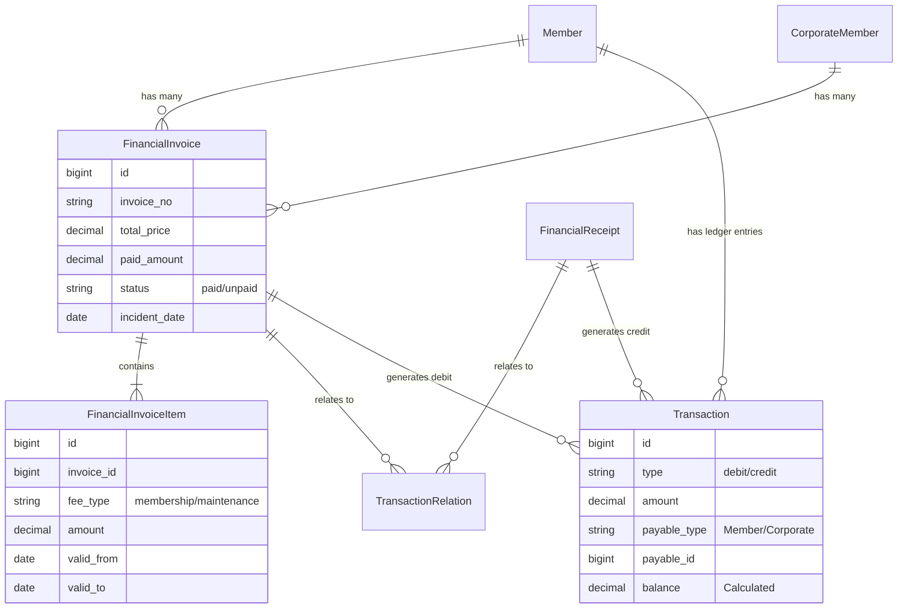

# System Architecture

## 1. Entity Relationship Diagram (ERD)

The core financial module revolves around `FinancialInvoice` which connects Members to payments (Receipts) and ledger entries (Transactions).



## 2. Core Models

### FinancialInvoice (`app/Models/FinancialInvoice.php`)

The central header record for any financial obligation.

- **Polymorphic**: Can belong to `Member`, `CorporateMember`, `Guest` (via Customer).
- **Status**: Tracks `paid`, `unpaid`, `partial`, `cancelled`.
- **Key Relations**: `items()`, `receipts()` (via relation), `ledgerEntries()` (via polymorphic reference).

### FinancialInvoiceItem (`app/Models/FinancialInvoiceItem.php`)

Stores the line items of an invoice.

- **Purpose**: Allows one invoice to contain multiple fees (e.g., "Subscription" AND "Maintenance").
- **Crucial Fields**: `valid_from`, `valid_to` (Defines the period paid for).

### Transaction (`app/Models/Transaction.php`) - The "Ledger"

Represents a single line on the Member's Account Statement.

- **Debit**: created when an Invoice is stored.
- **Credit**: created when a Receipt is stored.
- **Balance**: Calculated dynamically or via helper `MemberTransactionController::getLedgerBalance`.

### FinancialReceipt (`app/Models/FinancialReceipt.php`)

Proof of payment.

- Stores `payment_method` (Cash, Cheque, Online).
- Linked to Invoices via `TransactionRelation`.

### MaintenanceFee (`app/Models/MaintenanceFee.php`) [DEPRECATED]

- Legacy table.
- **Status**: Read-only/Deprecated.
- **Replacement**: `FinancialInvoiceItem` with `fee_type='maintenance_fee'`.

## 3. Directory Structure

```
/app
  /Http
    /Controllers
      MemberTransactionController.php  <-- Main Logic
      FinancialController.php          <-- Listing/Filtering
  /Models
    FinancialInvoice.php
    FinancialInvoiceItem.php
    Transaction.php
/resources
  /js
    /components
      /App
        /Transactions
          Create.jsx            <-- Main Form
          InvoiceItemsGrid.jsx  <-- Items UI
    /pages
      /App
        /Admin
          /Finance
            Transaction.jsx     <-- Listing Page
```
